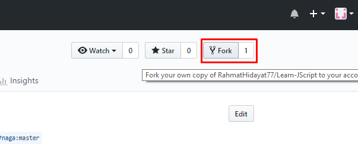
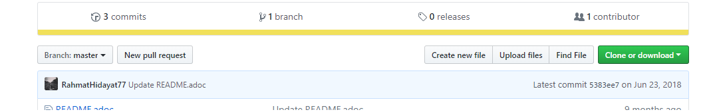
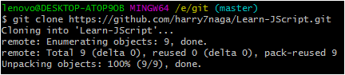
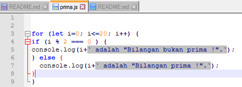
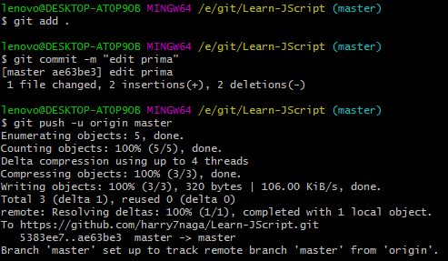
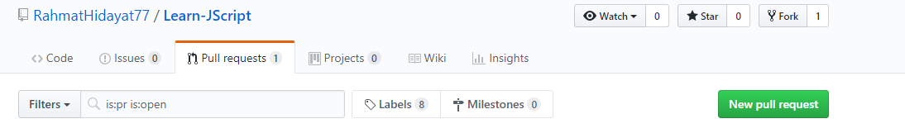
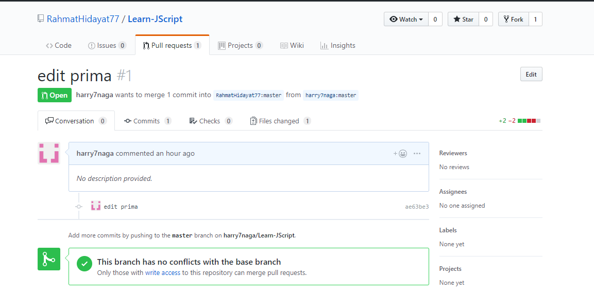

# Langkah Pull dan request 

1. Masuk ke akun github.com dan lakukan fork pada repository yang ingin kita edit nanti

2. Setelah itu kemudian clone untuk memindahkan ke local directory

- Ini perintah clone pada git

3. Kemudian lakukan modifikasi file, lanjut langsung di push kembali dan beri commit 

4. Setelah itu membuat pull request pada github

5. Kemudian kita akan melihat hasilnya yang kita modifikasi pada halaman pull request, dan menunggu apakah hasil dari mofifikasi diterima untuk diubah atau tidak

