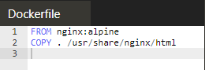

# Mengetahui perbedaan Container dan images

* Membuat container yang baru
1. Mengikuti kursus yang ada pada katacoda perintah pertama melihat docker images apa aja yang sudah di dalam system katacoda sebelumnya

2. Mencari container yang berjalan pada katacoda ini dengan syntax dibawah ini

3. Setelah itu kita belum dapat melihat proses yang berjalan pada container karena kita belum memberi access untuk container ini dengan cara menyambungkan port pada images redis ini seperti dibawah ini: 

4. Kemudian kita akan mengkases container yang sudah diberikan access tadi dan juga membuat satu container yang baru juga dengan syntax yang dibawah ini :

5. Kemudian kita akan membuat persiting data yang berguna jika kita suatu saat membuat images pada docker hub kemudian images tersebut dimatikan atau dihapus : 

